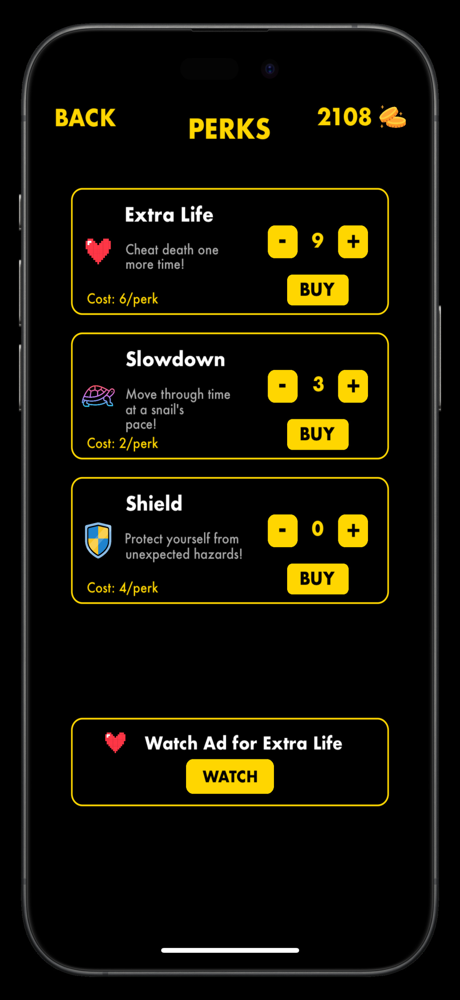
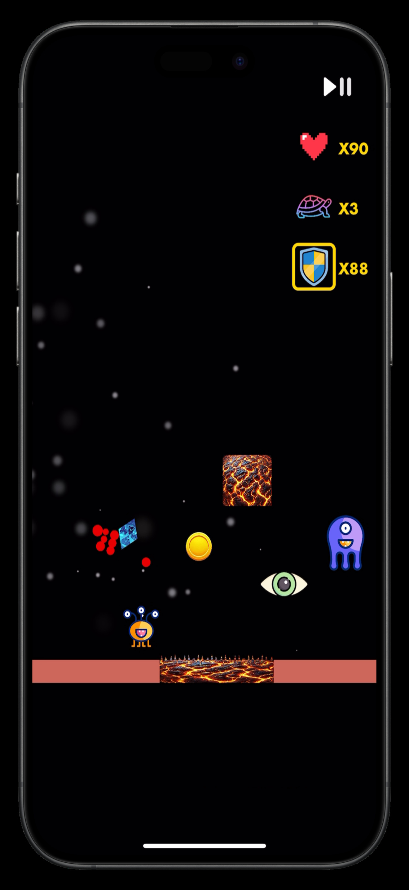
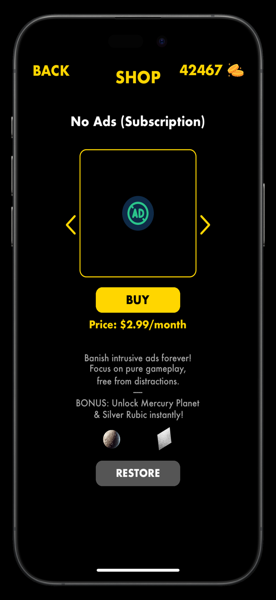

# CrazyRubic

Spin, Dodge & Survive in a Volcanic Chaos! Challenge your reflexes with fast-paced action and molten mayhem.

[**Download Now**](#download)

---

## Description

Welcome to **CrazyRubic**, a fiery arcade-style adventure where quick reflexes and strategy determine your fate. Battle through rising lava levels, dodge fearsome obstacles, and aim for the top of the global leaderboards.

Enjoy seamless gameplay, intuitive controls, and a never-ending swirl of molten twists. Are you ready for the ultimate volcanic test?

By using this app, you agree to the [Apple Standard EULA](https://www.apple.com/legal/internet-services/itunes/dev/stdeula/) (opens in new tab).

---

## Key Features

- **Fast-Paced Action**  
  Experience quick, heart-pounding gameplay that tests every ounce of your reflexes.

- **Global Leaderboards**  
  Compete with players worldwide—climb the charts, overthrow the competition.

- **Endless Variety**  
  Adapt to shifting lava flows, random hazards, and new combos each run—no two games are alike!

---

## Game Preview

Below is a short game preview video (example link only).  
*(Note: Markdown can’t directly embed a playable video in GitHub’s preview — typically it will appear as a link. You could embed an `<video>` tag in raw HTML, though.)*

[Promo Video (MP4)](promo.mp4)

---

## What Players Say

> “CrazyRubic takes mobile gaming to a new level—it's fast, fun, and incredibly addictive!”  
> — *GamerGuy42*

> “I love the quick sessions. Perfect for short breaks, but then I end up playing for hours!”  
> — *Sarah B.*

> “There's always something new to dodge or spin around. Can't put it down!”  
> — *Leo K.*

---

## Screenshots

Below are some in-game screenshots:

|  |  |  |
|-------------------------|-------------------------|-------------------------|
|  |  |  |
|  |  |  |
|  |                     |                     |

---

## Detailed Gameplay

**CrazyRubic** is about careful timing, quick reflexes, and on-the-fly decision-making. As you move forward across dangerous terrain, lava rises, and new waves of enemies appear.

### Combo System

Each monster you defeat increases your combo meter. String together multiple monster kills without getting hit to unlock special streak rewards—like bonus coins or short bursts of invincibility.

### Level Progression

- **Obstacle Count:** Each obstacle destroyed ramps up the difficulty.  
- **Monster Slay Rewards:** Slaying monsters quickly can trigger big coin multipliers.  
- **Adaptive Speed:** As you survive longer, your hero speeds up and lava obstacles multiply.

### Randomized Hazards

Watch out for chasing meteors, lava pits, and spinning fire. No two runs are alike!

---

## How to Play

1. **Tap & Hold:** Spin your CrazyRubic hero.  
2. **Dodge Obstacles:** Keep clear of lava blocks, meteor storms, and unpredictable flames.  
3. **Collect Boosts:** Power-ups grant speed bursts or invincibility.  
4. **Climb Leaderboards:** Survive longer, defeat monsters, and chase those high scores!

---

## Heroes & Planets

From celestial guardians to volcanic warriors, each Rubic hero has unique lore. Choose your planet environment—from Mercury’s scorching wastes to Neptune’s icy plains—for fresh challenges.

### Heroes

- **Tiger Stone Rubic** – Fierce amber stripes conjure primal spirits.  
- **Silver Rubic** – Lunar metal that reflects blows like moonlight.  
- **Lapis Lazuli Rubic** – Harnesses tidal spells from ocean depths.  
- *… plus more unique hero forms!*

### Planets

Every planet changes the lava type and background aesthetic. Brave Mercury’s scorching surface or hop among Saturn’s rings—each location demands new strategies.

- **Moon:** Lower gravity, cratered landscapes.  
- **Venus:** Toxic fumes and blazing greenhouse effect.  
- **Mars:** Rusty deserts, swirling dust devils.  
- **Neptune:** Freezing storms with “magma_ice” hazards.  
- **And more!**

---

## Perks & Power-Ups

Give yourself an edge! Collect coins to buy perks or watch ads for an instant boost.

- **Extra Life:** Revive once more after a fatal hit—perfect for record attempts.  
- **Slowdown:** Temporarily slow the entire game, perfect for escaping danger.  
- **Shield:** Nullifies one collision with lava or enemies.

---

## Monsters & Bosses

Whether they’re floating eyes or earthbound brutes, CrazyRubic’s monsters require quick reflexes to defeat. Defeating multiple enemies quickly can yield big combos or special drops.

| **Brown Crusher**    | **Green Jumper**    | **Purple Floater**    | **All-Seeing Eye**    |
|:--------------------------------------------------:|:---------------------------------------------------:|:------------------------------------------------------:|:-------------------------------------------------:|
| Lumbers around. Easy to dodge alone,   but forms deadly packs. | Bounces erratically,   leaps over small lava pits! | Hovers and swoops—tricky   if you’re focused on lava. | Fires homing beams;   best taken out quickly. |

---

## Frequently Asked Questions

**Q: Is CrazyRubic free-to-play?**  
A: Yes! You can play for free. Optional perks, coin packs, and subscriptions are available.

**Q: How do I unlock more heroes?**  
A: Earn or buy coins, then head to the in-game Shop. Some exclusive heroes come with subscriptions or special events.

**Q: Can I play offline?**  
A: Absolutely. You only need internet for leaderboards, watching ads, or in-app purchases.

---

## Shop & Subscriptions

Need extra coins for perks or looking to remove ads? Support our development and enjoy the game ad-free with subscription options or grab coin packs.

| **No Ads**  | **4,000 Coins** | **10,000 Coins** | **15,000 Coins** |
|:-----------:|:---------------:|:----------------:|:----------------:|
| Monthly subscription that removes all ads   and grants bonus Mercury Planet & Silver Rubic.   [Subscribe](#) | A handy starter stash for   perks or hero unlocks.   [Buy Now](#) | Supercharge your journey   with a bigger coin bundle.   [Buy Now](#) | Get a mega stack to unlock   multiple heroes & perks.   [Buy Now](#) |

> Subscriptions renew automatically unless canceled at least 24 hours before the end of the current period.

---

## Download

  
[**Download on the App Store**](https://apps.apple.com/ch/app/crazyrubic/id6740188562?l=en-GB)

---

## Privacy Policy & Attribution

- [**Privacy Policy**](https://artur-dobysh.github.io/CrazyRubic_Privacy_Policy/)  
- [**Attribution & Credits**](https://artur-dobysh.github.io/CrazyRubic_Attribution/)

---

## Stay Connected

Follow us on social media or sign up for our newsletter to get the latest updates!

[Instagram](https://www.instagram.com/crazyrubic/) | [Facebook](https://www.facebook.com/profile.php?id=61572398047212)

---

© 2025 Artur Dobysh. All Rights Reserved.
